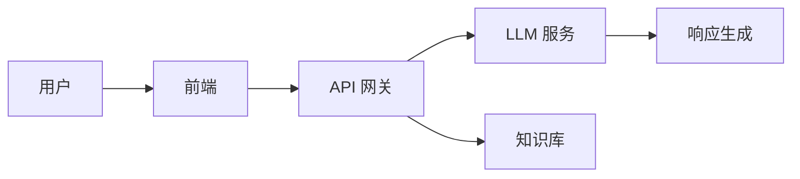

# AI 产品开发计划

## 📌 项目概述

这个项目旨在开发一个 [[智能助手系统]]，集成 [[LLM 技术]] 和 [[知识管理]]。

> [!important] 关键里程碑
> 第一阶段必须在 ==2026年2月15日== 前完成原型开发。

## ✅ 任务清单

- [x] 需求分析
- [x] 技术选型
- [ ] 核心开发
  - [ ] 后端 API
  - [ ] 前端界面
  - [x] 数据库设计
- [ ] 测试部署

## 📊 技术架构

## 💡 关键决策

> [!tip] 技术选择
> 使用 RAG 架构来增强 LLM 的准确性。

> [!warning] 风险提示
> 需要注意 API 调用成本和响应延迟。

## 📐 数学公式

模型性能评估使用 F1 分数：

$$
F1 = 2 \times \frac{Precision \times Recall}{Precision + Recall}
$$

## 🔗 相关资源

- ![[Meeting Notes 2026-01-20#决策要点]]
- [[团队成员]]
- [[预算规划|项目预算]]

## 📝 备注

%%
内部备注：
- 周五与团队 review
- 考虑备选方案
%%

[^1]: 参考官方文档 https://docs.example.com
